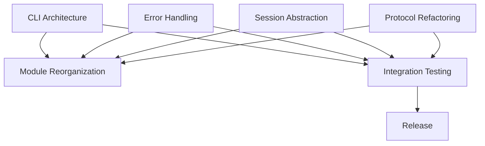

# ccswarm Refactoring Orchestration Plan

## Overview

This document orchestrates the refactoring work identified by similarity-rs analysis, distributing tasks across different work streams for efficient parallel execution.

## Work Stream Distribution

### Stream 1: CLI Architecture Refactoring (Agent: Backend)
**Priority**: CRITICAL  
**Duration**: Week 1-2  
**Dependencies**: None (can start immediately)

#### Tasks:
1. **Day 1-2**: Command Handler Framework
   - Create `CommandHandler` trait in `cli/command_handler.rs`
   - Implement `CommandRegistry` pattern
   - Create macro for command registration

2. **Day 3-4**: Command Migration
   - Migrate 20 commands per day from switch statement
   - Create individual command modules in `cli/commands/`
   - Ensure backward compatibility

3. **Day 5**: Integration & Testing
   - Replace main switch statement with registry
   - Add comprehensive tests
   - Performance benchmarking

**Deliverables**:
- Reduced CLI module from 3000+ lines to <500 lines
- 60+ duplicate methods consolidated into trait implementations
- Command execution time improved by registry pattern

### Stream 2: Error Handling Consolidation (Agent: Frontend)
**Priority**: HIGH  
**Duration**: Week 1  
**Dependencies**: None

#### Tasks:
1. **Day 1**: Template Engine Enhancement
   - Enhance `ErrorTemplateEngine` in `utils/error_template.rs`
   - Create diagram builder API
   - Add color scheme support

2. **Day 2-3**: Error Catalog Creation
   - Extract all error diagrams to templates
   - Create error type enumeration
   - Implement context-aware error messages

3. **Day 4**: Integration
   - Replace all `ErrorDiagrams::*` calls with template engine
   - Add error tracking and metrics
   - Create error documentation

**Deliverables**:
- 8 error diagram methods reduced to 1 template engine
- Consistent error formatting across application
- Error documentation auto-generated

### Stream 3: Session Management Abstraction (Agent: DevOps)
**Priority**: HIGH  
**Duration**: Week 2  
**Dependencies**: Stream 1 completion

#### Tasks:
1. **Day 1-2**: Trait Definition
   - Create `SessionOperations` trait
   - Define `SessionLifecycle` trait
   - Implement `SessionContext` abstraction

2. **Day 3-4**: Implementation
   - Extract common code from session modules
   - Implement generic session manager
   - Add session middleware support

3. **Day 5**: Migration
   - Update all session types to use new traits
   - Add session persistence layer
   - Implement session recovery

**Deliverables**:
- 98% duplicate session code eliminated
- Unified session management API
- Session recovery and persistence

### Stream 4: Protocol Refactoring (Agent: Backend)
**Priority**: MEDIUM  
**Duration**: Week 2  
**Dependencies**: None

#### Tasks:
1. **Day 1**: Builder Pattern Design
   - Create `JsonRpcBuilder` trait
   - Implement fluent API design
   - Add validation layer

2. **Day 2-3**: Implementation
   - Replace all JSON-RPC constructors
   - Add type-safe builders
   - Implement protocol extensions

3. **Day 4**: Testing
   - Protocol compliance tests
   - Performance benchmarking
   - Integration testing

**Deliverables**:
- 90% reduction in JSON-RPC boilerplate
- Type-safe protocol implementation
- Extensible protocol framework

### Stream 5: Module Reorganization (Agent: Master)
**Priority**: LOW  
**Duration**: Week 3  
**Dependencies**: Streams 1-4 completion

#### Tasks:
1. **Day 1-2**: Module Analysis
   - Identify module boundaries
   - Create dependency graph
   - Plan module splits

2. **Day 3-4**: Reorganization
   - Split large modules (>1000 lines)
   - Create focused sub-modules
   - Update imports and exports

3. **Day 5**: Documentation
   - Update module documentation
   - Create architecture diagrams
   - Update developer guide

**Deliverables**:
- No module larger than 500 lines
- Clear module boundaries
- Improved code navigation

## Parallel Execution Plan

```
Week 1:
┌─────────────────────────────────────────────────────────┐
│ Backend Agent:  CLI Architecture (Stream 1 - Days 1-5)   │
├─────────────────────────────────────────────────────────┤
│ Frontend Agent: Error Handling (Stream 2 - Days 1-4)     │
├─────────────────────────────────────────────────────────┤
│ DevOps Agent:   Session Analysis (Stream 3 prep)         │
└─────────────────────────────────────────────────────────┘

Week 2:
┌─────────────────────────────────────────────────────────┐
│ Backend Agent:  Protocol Refactoring (Stream 4)          │
├─────────────────────────────────────────────────────────┤
│ DevOps Agent:   Session Abstraction (Stream 3)           │
├─────────────────────────────────────────────────────────┤
│ Frontend Agent: Testing & Documentation                   │
└─────────────────────────────────────────────────────────┘

Week 3:
┌─────────────────────────────────────────────────────────┐
│ Master Agent:   Module Reorganization (Stream 5)         │
├─────────────────────────────────────────────────────────┤
│ All Agents:     Integration Testing                       │
├─────────────────────────────────────────────────────────┤
│ QA Agent:       Performance & Regression Testing          │
└─────────────────────────────────────────────────────────┘
```

## Task Dependencies



## Success Metrics

1. **Code Reduction**
   - Target: 40-50% reduction in total LOC
   - Measurement: `tokei` before/after comparison

2. **Duplication Elimination**
   - Target: <10% code duplication (from 30%)
   - Measurement: `similarity-rs` analysis

3. **Test Coverage**
   - Target: Maintain 100% coverage
   - Measurement: `cargo tarpaulin`

4. **Performance**
   - Target: No regression, 10% improvement in CLI response time
   - Measurement: `criterion` benchmarks

## Risk Management

1. **Breaking Changes**
   - Mitigation: Feature flags for gradual rollout
   - Testing: Comprehensive integration tests

2. **Merge Conflicts**
   - Mitigation: Small, focused PRs
   - Strategy: Daily rebasing

3. **Performance Regression**
   - Mitigation: Continuous benchmarking
   - Strategy: Performance gates in CI

## Communication Protocol

- Daily sync: 10am UTC
- Progress tracking: GitHub Projects
- Blockers: Immediate escalation to Master Agent
- Code reviews: Within 4 hours of PR submission

## Next Steps

1. Create feature branches for each stream
2. Set up GitHub Projects for tracking
3. Initialize performance benchmarks
4. Begin Stream 1 & 2 immediately

---

*Orchestrated by Master Claude on 2025-07-03*