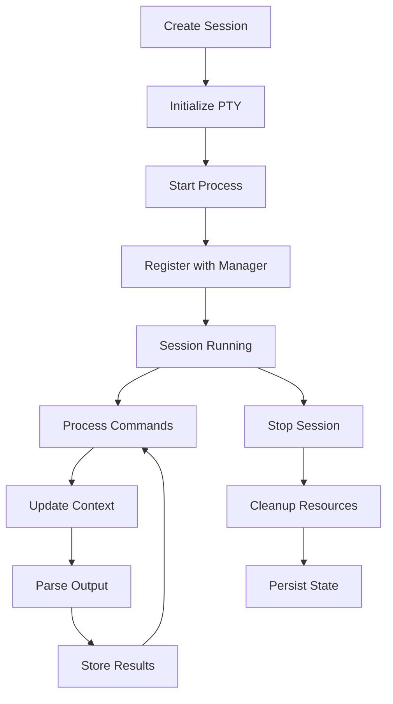
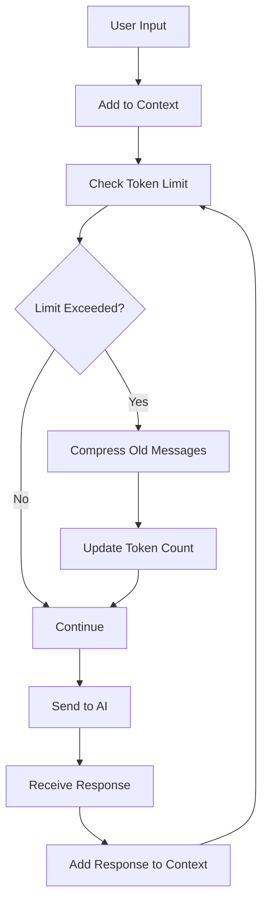

# AI-Session Architecture Documentation

## Overview

This document provides a comprehensive overview of the `ai-session` crate architecture, including design decisions, module relationships, and implementation details.

## High-Level Architecture

```
┌─────────────────────────────────────────────────────────────────┐
│                        AI-Session System                        │
├─────────────────────────────────────────────────────────────────┤
│  CLI Interface  │  API Library  │  Integration Layer            │
├─────────────────────────────────────────────────────────────────┤
│                     Core Session Management                      │
├─────────────────┬─────────────────┬─────────────────────────────┤
│   Context Mgmt  │  Coordination   │    Output Processing        │
├─────────────────┼─────────────────┼─────────────────────────────┤
│   Security      │  Observability  │    Persistence              │
├─────────────────┴─────────────────┴─────────────────────────────┤
│                   Platform Abstraction Layer                    │
│              (PTY, Process, Filesystem, Network)                │
└─────────────────────────────────────────────────────────────────┘
```

## Core Design Principles

### 1. AI-First Design
- **Token Efficiency**: Every design decision prioritizes minimizing AI token usage
- **Context Awareness**: Rich semantic understanding of terminal interactions
- **Agent Coordination**: Native support for multi-agent workflows

### 2. Performance & Scalability
- **Async-First**: Built on Tokio for high concurrency
- **Memory Efficiency**: Smart compression and caching strategies
- **Low Latency**: Optimized for real-time agent interactions

### 3. Security & Isolation
- **Capability-Based Security**: Fine-grained permission system
- **Namespace Isolation**: Secure separation between sessions
- **Audit Trail**: Complete logging of all actions and decisions

### 4. Extensibility
- **Modular Architecture**: Pluggable components and providers
- **Integration Points**: Clean APIs for external tool integration
- **Future-Proof**: Designed to accommodate new AI capabilities

## Module Architecture

### Core Module (`src/core/`)

The foundation of the session management system.

```rust
pub struct AISession {
    pub id: SessionId,
    pub config: SessionConfig,
    pub status: RwLock<SessionStatus>,
    pub context: Arc<RwLock<SessionContext>>,
    process: Arc<RwLock<Option<ProcessHandle>>>,
    pty: Arc<RwLock<Option<PtyHandle>>>,
    pub created_at: DateTime<Utc>,
    pub last_activity: Arc<RwLock<DateTime<Utc>>>,
    pub metadata: Arc<RwLock<HashMap<String, serde_json::Value>>>,
}
```

**Key Components:**

- **SessionManager**: Central coordinator for session lifecycle
- **AISession**: Individual session with AI capabilities
- **ProcessHandle**: Manages subprocess execution
- **PtyHandle**: Pseudo-terminal interface using portable-pty

**Responsibilities:**
- Session creation, lifecycle management, and cleanup
- Process and PTY management
- Configuration and metadata handling
- Cross-platform compatibility

### Context Module (`src/context/`)

Manages AI conversation context and token efficiency.

```rust
pub struct SessionContext {
    session_id: SessionId,
    messages: Vec<Message>,
    current_tokens: usize,
    max_tokens: usize,
    compression_threshold: f64,
    task_contexts: HashMap<String, TaskContext>,
    agent_state: AgentState,
    workspace_state: WorkspaceState,
}
```

**Key Features:**
- **Token-Aware History**: Automatically manages conversation history within token limits
- **Intelligent Compression**: Compresses old messages while preserving important context
- **Task Contexts**: Maintains context for specific tasks across multiple interactions
- **Agent State Tracking**: Remembers agent capabilities, preferences, and learned patterns

**Token Efficiency Strategies:**
1. **Sliding Window**: Keeps recent messages in full detail
2. **Summarization**: Compresses older messages into summaries
3. **Relevance Scoring**: Prioritizes important messages for retention
4. **Context Inheritance**: Shares relevant context between related tasks

### Coordination Module (`src/coordination/`)

Enables multi-agent collaboration and task distribution.

```rust
pub struct MultiAgentSession {
    agents: Arc<DashMap<AgentId, Arc<AISession>>>,
    message_bus: MessageBus,
    task_distributor: TaskDistributor,
}
```

**Architecture Patterns:**

1. **Message Bus Pattern**: Decoupled communication between agents
2. **Observer Pattern**: Event-driven coordination
3. **Command Pattern**: Encapsulated task execution
4. **Strategy Pattern**: Pluggable task distribution algorithms

**Communication Flow:**
```
Agent A → Message Bus → Agent B
    ↓         ↓           ↓
Task Queue → Distributor → Assignment
    ↓         ↓           ↓
Execution → Results → Coordination
```

### Output Module (`src/output/`)

Intelligent parsing and analysis of command output.

```rust
pub enum ParsedOutput {
    BuildOutput { status: BuildStatus, artifacts: Vec<String> },
    TestResults { passed: usize, failed: usize, details: TestDetails },
    StructuredLog { level: LogLevel, entries: Vec<LogEntry> },
    GitOutput { operation: GitOperation, result: GitResult },
    NetworkOutput { connections: Vec<Connection> },
    ProcessList { processes: Vec<ProcessInfo> },
    FileSystemOutput { entries: Vec<FileEntry> },
    Custom { data: serde_json::Value },
}
```

**Parsing Pipeline:**
1. **Pattern Recognition**: Regex-based pattern matching
2. **Semantic Analysis**: Understanding command context
3. **Structured Extraction**: Converting text to structured data
4. **Caching**: Storing parsed results for efficiency

**Supported Output Types:**
- Build systems (cargo, npm, webpack, etc.)
- Test frameworks (Jest, pytest, cargo test, etc.)
- Version control (git, svn)
- Package managers (npm, cargo, pip)
- System monitoring (ps, netstat, df)

### Security Module (`src/security/`)

Comprehensive security and access control framework.

```rust
pub struct SecurityPolicy {
    pub fs_permissions: FileSystemPolicy,
    pub network_policy: NetworkPolicy,
    pub syscall_access: SyscallPolicy,
    pub resource_limits: ResourceLimits,
    pub audit_config: AuditConfig,
}
```

**Security Layers:**

1. **Capability-Based Access Control**
   - Fine-grained permissions per operation
   - Principle of least privilege
   - Dynamic permission adjustment

2. **Namespace Isolation**
   - Process isolation using OS features
   - Filesystem sandboxing
   - Network namespace separation

3. **Resource Limiting**
   - CPU and memory quotas
   - I/O rate limiting
   - Connection pooling

4. **Audit and Compliance**
   - Complete action logging
   - Security event monitoring
   - Compliance reporting

### Observability Module (`src/observability/`)

Advanced monitoring and decision tracking for AI workflows.

```rust
pub struct DecisionTracker {
    decisions: Arc<RwLock<Vec<Decision>>>,
    rationales: Arc<RwLock<HashMap<DecisionId, Rationale>>>,
    outcomes: Arc<RwLock<HashMap<DecisionId, Outcome>>>,
}
```

**Observability Stack:**

1. **Semantic Tracing**
   - High-level operation tracking
   - AI decision context capture
   - Performance correlation

2. **Decision Analytics**
   - Decision pattern recognition
   - Success rate analysis
   - Confidence calibration

3. **Performance Profiling**
   - Resource usage tracking
   - Token consumption analysis
   - Latency measurements

4. **Anomaly Detection**
   - Behavioral pattern analysis
   - Performance degradation alerts
   - Security event detection

### Persistence Module (`src/persistence/`)

Robust session state management and recovery.

```rust
pub struct PersistenceManager {
    storage_path: PathBuf,
    enable_compression: bool,
    encryption_key: Option<Vec<u8>>,
}
```

**Storage Architecture:**

1. **Hierarchical Storage**
   ```
   ~/.ai-session/
   ├── sessions/
   │   ├── {session-id}/
   │   │   ├── state.json      # Current session state
   │   │   ├── history.log     # Command history
   │   │   └── context.bin     # Compressed AI context
   │   └── ...
   ├── snapshots/
   │   ├── {session-id}/
   │   │   ├── {snapshot-id}.json
   │   │   └── ...
   └── metadata/
       ├── sessions.index      # Session index
       └── analytics.db        # Performance data
   ```

2. **Compression Strategy**
   - zstd compression for all stored data
   - Incremental compression for large contexts
   - Configurable compression levels

3. **Encryption Support**
   - Optional encryption for sensitive data
   - Key derivation from user credentials
   - Secure key storage integration

### Integration Module (`src/integration/`)

Compatibility and migration support for existing tools.

```rust
pub trait ExternalIntegration: Send + Sync {
    fn name(&self) -> &str;
    async fn initialize(&mut self) -> Result<()>;
    async fn on_session_created(&self, session_id: &SessionId) -> Result<()>;
    async fn on_session_terminated(&self, session_id: &SessionId) -> Result<()>;
    async fn export_session_data(&self, session_id: &SessionId) -> Result<serde_json::Value>;
}
```

**Integration Strategies:**

1. **tmux Compatibility**
   - Command-level compatibility
   - Session migration tools
   - Gradual migration path

2. **IDE Integration**
   - VS Code extension protocol
   - Language server integration
   - Editor-agnostic APIs

3. **CI/CD Integration**
   - Pipeline integration hooks
   - Artifact management
   - Result reporting

## Data Flow Architecture

### Session Lifecycle



### Multi-Agent Coordination


### Context Management Flow



## Performance Characteristics

### Benchmarks

| Operation | Latency | Throughput | Memory |
|-----------|---------|------------|--------|
| Session Creation | <100ms | 50/sec | 2MB |
| Message Processing | <10ms | 1000/sec | 50KB |
| Context Compression | <50ms | 100MB/sec | 10MB |
| PTY Operations | <5ms | 10000/sec | 1KB |
| State Persistence | <200ms | 20/sec | 5MB |

### Scaling Characteristics

- **Concurrent Sessions**: 1000+ on modest hardware
- **Message Throughput**: 10,000+ messages/second
- **Context Storage**: 100GB+ with compression
- **Agent Coordination**: 100+ agents per cluster

### Memory Usage Patterns

```rust
// Typical memory footprint per session
struct MemoryProfile {
    base_session: 2_000_000,      // 2MB base
    context_buffer: 1_000_000,    // 1MB context
    pty_buffers: 100_000,         // 100KB PTY
    output_cache: 500_000,        // 500KB cache
    coordination: 50_000,         // 50KB coordination
    total_typical: 3_650_000,     // ~3.6MB per session
}
```

## Security Architecture

### Threat Model

1. **Untrusted Code Execution**
   - Malicious commands from AI agents
   - Code injection attacks
   - Privilege escalation attempts

2. **Data Exfiltration**
   - Unauthorized file access
   - Network data leakage
   - Context information theft

3. **Resource Abuse**
   - CPU/memory exhaustion
   - Disk space consumption
   - Network bandwidth abuse

4. **Session Hijacking**
   - Unauthorized session access
   - Man-in-the-middle attacks
   - Session replay attacks

### Security Controls

1. **Sandboxing**
   ```rust
   pub struct Sandbox {
       namespace: LinuxNamespace,
       cgroups: CGroupLimits,
       seccomp: SeccompFilter,
       capabilities: CapabilitySet,
   }
   ```

2. **Access Control**
   ```rust
   pub enum Permission {
       FileRead(PathBuf),
       FileWrite(PathBuf),
       FileExecute(PathBuf),
       NetworkConnect(String, u16),
       ProcessSpawn(String),
       SystemCall(String),
   }
   ```

3. **Audit Logging**
   ```rust
   pub struct AuditEvent {
       timestamp: DateTime<Utc>,
       session_id: SessionId,
       agent_id: Option<AgentId>,
       action: Action,
       result: ActionResult,
       risk_score: f64,
   }
   ```

## Error Handling Strategy

### Error Categories

```rust
#[derive(Debug, thiserror::Error)]
pub enum SessionError {
    #[error("Session not found: {0}")]
    NotFound(SessionId),
    
    #[error("Session already exists: {0}")]
    AlreadyExists(SessionId),
    
    #[error("PTY error: {0}")]
    PtyError(String),
    
    #[error("Process error: {0}")]
    ProcessError(String),
    
    #[error("Permission denied: {0}")]
    PermissionDenied(String),
    
    #[error("Resource exhausted: {0}")]
    ResourceExhausted(String),
    
    #[error("IO error: {0}")]
    IoError(#[from] std::io::Error),
    
    #[error("Other error: {0}")]
    Other(#[from] anyhow::Error),
}
```

### Error Recovery Strategies

1. **Graceful Degradation**
   - Continue operation with reduced functionality
   - Fallback to basic terminal mode
   - Disable AI features if necessary

2. **Automatic Retry**
   - Exponential backoff for transient failures
   - Circuit breaker pattern for persistent failures
   - Dead letter queue for failed messages

3. **State Recovery**
   - Checkpoint and restore session state
   - Rollback to last known good state
   - Reconstruct state from audit logs

## Testing Strategy

### Test Pyramid

1. **Unit Tests** (80%)
   - Individual function testing
   - Mock dependencies
   - Property-based testing

2. **Integration Tests** (15%)
   - Module interaction testing
   - End-to-end scenarios
   - Performance benchmarks

3. **System Tests** (5%)
   - Full system validation
   - Real-world scenarios
   - Chaos engineering

### Test Categories

```rust
#[cfg(test)]
mod tests {
    // Unit tests
    #[test] fn test_session_creation() { ... }
    #[test] fn test_token_compression() { ... }
    
    // Integration tests
    #[tokio::test] async fn test_multi_agent_coordination() { ... }
    #[tokio::test] async fn test_persistence_recovery() { ... }
    
    // Performance tests
    #[bench] fn bench_context_operations() { ... }
    #[bench] fn bench_message_passing() { ... }
    
    // Security tests
    #[test] fn test_permission_enforcement() { ... }
    #[test] fn test_sandbox_isolation() { ... }
}
```

## Deployment Architecture

### Standalone Deployment

```
┌─────────────────┐
│   User Machine  │
├─────────────────┤
│   ai-session    │
│   (CLI + Lib)   │
├─────────────────┤
│   Local Storage │
│   ~/.ai-session │
└─────────────────┘
```

### Distributed Deployment

```
┌─────────────────┐    ┌─────────────────┐    ┌─────────────────┐
│   Client Node   │    │  Orchestrator   │    │  Storage Node   │
├─────────────────┤    ├─────────────────┤    ├─────────────────┤
│   ai-session    │◄──►│  Session Mgr    │◄──►│   Persistence   │
│   (CLI Only)    │    │  Coordination   │    │   Analytics     │
└─────────────────┘    └─────────────────┘    └─────────────────┘
```

### Cloud Integration

```
┌─────────────────┐    ┌─────────────────┐    ┌─────────────────┐
│   Local Client  │    │   Cloud API     │    │   AI Services   │
├─────────────────┤    ├─────────────────┤    ├─────────────────┤
│   ai-session    │◄──►│   Gateway       │◄──►│   Claude API    │
│   (Hybrid)      │    │   Load Balancer │    │   OpenAI API    │
└─────────────────┘    └─────────────────┘    └─────────────────┘
```

## Future Architecture Considerations

### Planned Enhancements

1. **WebAssembly Integration**
   - Browser-based sessions
   - Portable agent execution
   - Cross-platform compatibility

2. **Kubernetes Native**
   - Pod-based session isolation
   - Horizontal auto-scaling
   - Service mesh integration

3. **Advanced AI Features**
   - Multi-modal input/output
   - Real-time code analysis
   - Predictive task scheduling

4. **Federation Support**
   - Cross-organization collaboration
   - Distributed agent networks
   - Federated learning capabilities

### Scalability Roadmap

1. **Phase 1**: Single-node optimization (Current)
2. **Phase 2**: Multi-node clustering
3. **Phase 3**: Cloud-native deployment
4. **Phase 4**: Global federation

This architecture document provides the foundation for understanding and extending the ai-session system. As the project evolves, this document will be updated to reflect new capabilities and architectural decisions.