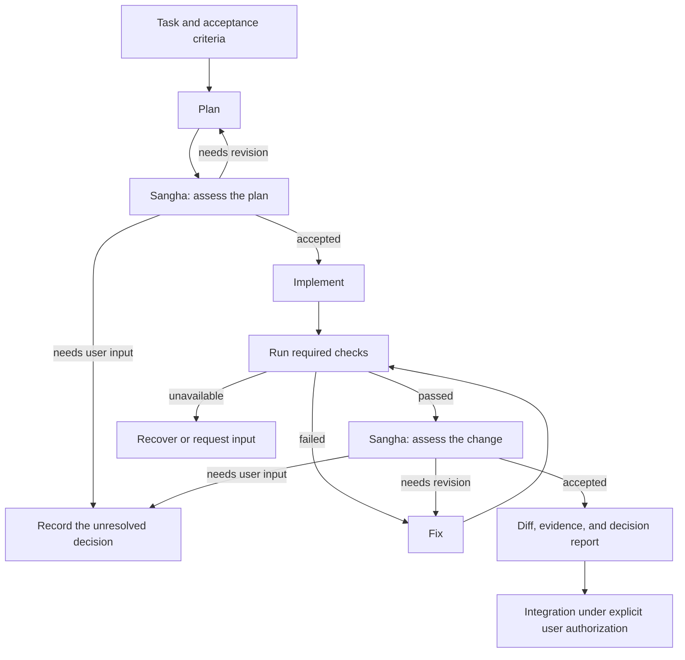

# Sangha As The ccswarm Product Core

Status: product design; implementation gaps are listed below.
Research and source-code review: 2026-09-09.

## Product Decision

**ccswarm should turn uncertain coding work into a reviewable change through
Sangha: shared acceptance criteria, separate assessments, evidence-backed
objections, bounded revision, and a recorded decision.**

Sangha governs the important decisions in a flow. Providers execute the work;
the workflow engine decides whether the evidence permits the next stage.
The product outcome is a change the user can assess without reconstructing
every agent conversation.

The primary job, derived from the existing
[Product Abstraction Plan](CCSWARM_PRODUCT_ABSTRACTION_PLAN.md#primary-job), is:

> When I delegate important development work whose solution is uncertain,
> help me reach a verified, reviewable change, understand unresolved concerns,
> and intervene only where my judgment is needed.

The functional outcome is a justified acceptance decision. The emotional
outcome is less anxiety about silent failures and lost work. The social
outcome is a credible explanation of the change for another reviewer.
Agent count and unanimous agreement are not measures of those outcomes.

## What The Name Contributes

Saṅgha is a Buddhist term for community. Its conventional monastic and ideal
spiritual senses are distinct; it is not the name of a software voting
algorithm. See the [Pali glossary](https://accesstoinsight.org/glossary.html#sangha).

The Theravada Vinaya account in *The Buddhist Monastic Code* discusses the
validity of community proceedings, participation, procedure, and objections.
Its dispute-settlement account describes majority voting under conditions
after attempts at settlement have failed. This supports drawing inspiration
from a community's procedure for addressing disagreement, rather than
equating Sangha with a two-thirds vote. These sources describe a particular
tradition, not every Buddhist community.
[Community Transactions](https://www.dhammatalks.org/vinaya/bmc/Section0052.html),
[Settling Issues](https://www.dhammatalks.org/vinaya/bmc/Section0027.html).

The software design below is ccswarm's adaptation. It does not reproduce
religious membership or disciplinary rules, claim Buddhist authority, or
provide distributed-system consensus guarantees.

| Inspiration | ccswarm behavior to build |
| --- | --- |
| Shared practice and rules | Agree on the task, acceptance criteria, and decision policy before assessment |
| Participation in a common proceeding | Give each required reviewer the same identified evidence snapshot |
| Hearing objections | Preserve concerns and connect each blocking concern to a requirement or demonstrated failure |
| A valid procedure matters | Validate reports, required checks, participation, and authority before accepting |
| Settlement | Resolve concerns through fixes, evidence, or an explicit user decision within a bounded process |

## The Standard Flow To Build

This is the target flow, not the currently shipped default. Today the default
is `plan -> sangha -> implement -> review -> fix -> complete`; its final review
is an ordinary stage. Revision loops in the target flow share a finite run
budget; the diagram does not authorize unlimited retries.

The two Sangha checkpoints answer different questions:

- **Plan:** Is the approach sufficiently specified and proportionate to the
  task? Are acceptance criteria and verification feasible?
- **Change:** Does this exact change satisfy those criteria, with the required
  checks and review evidence available?

Apply deliberation at these boundaries, not at every tool call. The existing
`quick` flow remains an explicit shortcut; it must not present its result as
Sangha-reviewed. A plan approval never substitutes for review of the change.

## Essential Features

### 1. A Shared Subject With Separate Assessments

Use the existing planner, reviewer, and QA roles as the initial three-member
default. Each assessment names the same task, criteria, plan or change
revision, and applicable policy. Initial reviewers do not see one another's
votes. Separate review context from implementation context where the backend
can enforce that separation.

Record the actual provider and model used. Different personas or separate
processes do not establish statistically independent errors. Per-member
provider selection is a later option, not a prerequisite or a current feature.

Review must not modify the subject being assessed. Enforce that boundary with
backend permissions or an isolated review environment. A prompt requesting
read-only behavior is insufficient. Reject a backend that cannot meet the
configured boundary, and invalidate evidence if its subject changes.

### 2. Evidence And Objections Before Vote Totals

A member report needs a recommendation, reasons, criterion references,
evidence references, and any objections. Keep execution status separate from
the recommendation: an errored call is not a successful review, even if its
partial output contains an approval marker.

A **blocking objection** identifies an unmet acceptance criterion, a violated
mandatory policy, or a concrete defect with supporting evidence or a
reproducible check. An **advisory concern** records a preference or improvement
that does not prevent acceptance. Missing evidence for a required criterion
prevents acceptance; an unsupported assertion of a defect requests focused
verification rather than granting an agent an unlimited veto.

For example, two approvals cannot dismiss a third reviewer's reproduction of
an authorization bypass. The run requests a fix and repeats affected checks
and reviews on the new revision. A naming preference can remain advisory in
an otherwise accepted decision report.

### 3. Deterministic Acceptance And Bounded Revision

The initial target keeps a minimum of two approvals among three configured
members, while requiring all designated reviews to complete validly. Quorum
is one condition, not the whole decision. Acceptance requires:

1. Reports refer to the current subject and decision policy.
2. Required members and criteria are covered by valid, successful reports.
3. All mandatory machine checks have passed for that subject.
4. Valid approvals meet the configured quorum.
5. No blocking objection remains unresolved.

Validate that quorum is reachable before starting. Count a member once per
decision revision; retries do not create extra voters. Never lower quorum or
drop required roles because a provider failed or a budget expired.

Resolve an objection with a fix and verification, or a documented rebuttal
supported by evidence. Present the resolution for reassessment; a synthesizer
cannot silently remove a concern or cast an overriding vote. If the evidence
still does not settle it, request user input. Changing scope or an optional
policy creates a new decision revision; it does not rewrite earlier votes or
turn failed mandatory checks into passes.

Use existing stage-visit and timeout controls as the starting point. Bound
review rounds, repair attempts, elapsed time, and cost when measurable. When
usage is unavailable, say so and enforce the limits that are available. Budget
exhaustion must not be reported as acceptance.

The target decision outcomes are `accepted`, `needs_revision`, and
`needs_input`. Execution outcomes such as failure, timeout, and cancellation
remain separate. These are design concepts, not a new serialized format or
supported YAML syntax in this document.

### 4. A Decision Report The User Can Act On

The report should answer, in this order:

- What was accepted, or what prevents acceptance?
- Which revision and acceptance criteria were assessed?
- Which checks ran, and where are their results?
- What did each required reviewer conclude?
- Which concerns were fixed, rebutted, or left advisory, and why?
- What input or next action is needed, and what work can be reused?

Store detailed evidence locally with controlled access and redaction. Export
summary metadata by default; do not copy prompts, repository contents, or
credentials into telemetry. Report known time and usage with unknown values
explicit, rather than estimates presented as measurements.

Sangha acceptance authorizes only the next configured workflow stage. Commit,
push, merge, deployment, and destructive actions still require the applicable
user authorization. Reviewer agreement cannot grant those permissions.

### 5. Recovery That Preserves Valid Evidence

Persist the decision subject, member attempts, reports, checks, objections,
verdict, and next stage atomically at meaningful boundaries. Identify the
reviewed content, including relevant uncommitted and untracked files; a Git
commit ID alone is insufficient.

On resume, validate repository identity, content, criteria, flow, and policy.
Reuse successful reports only when their inputs remain valid. A changed file
or requirement invalidates dependent evidence. A lost provider call may need
to run again, but its retry must not count twice. Do not claim exactly-once
external side effects.

Expose active, waiting, failed, timed-out, and canceled work with a reason and
a recovery action. Re-running a recorded task is replay, not checkpoint resume.

## Current Implementation And Gaps

The following observations come from the local source reviewed on 2026-09-09;
they are not claims that the target behavior above already works.

| Area | Current behavior | Required next behavior |
| --- | --- | --- |
| Membership | `SanghaSpec` defaults to planner/reviewer/QA and quorum 2; unreachable quorum is rejected | Add required review coverage |
| Assessment | Parallel member stages share the parent provider/model; members have persona/agent fields | Identify shared evidence and actual execution context; keep initial votes separate |
| Recommendation | The last nonempty line supplies `APPROVE`, `REVISE`, or `ABSTAIN`; other endings abstain | Validate a report with reasons, evidence, and objections |
| Acceptance | Only completed member outputs contribute recommendations; other execution states abstain. Successful approvals must meet quorum | Bind reports to current evidence and enforce all remaining acceptance conditions |
| Dissent | Enough approvals can accept despite a `REVISE` vote | Resolve blocking objections and retain advisory dissent |
| Machine checks | Sangha dispatch returns before ordinary stage gates; member stages clear gates | Explicitly execute and bind required checks to the decision subject |
| Review permissions | Members request `readonly` by default, but the Codex adapter builds `--sandbox workspace-write` | Enforce the requested boundary or reject the unsupported configuration |
| Standard flow | Sangha assesses the plan; final review is a normal stage | Assess the final change through Sangha after checks pass |
| Recovery | Session persistence and event logs exist; replay re-executes the task | Durable decision checkpoints and validated targeted resume |
| Proposal commands | `lab sangha` stores proposal JSON and appended votes, without voter identity or quorum-driven transitions | Keep experimental proposal storage distinct from workflow decisions |

Implementation references:
[member configuration and parsing](../crates/ccswarm/src/workflow/sangha.rs),
[flow validation and execution](../crates/ccswarm/src/workflow/flow.rs),
[Codex command construction](../crates/ccswarm/src/providers/codex.rs),
[post-pipeline verification](../crates/ccswarm/src/cli/handlers/workflow.rs),
[experimental proposal handlers](../crates/ccswarm/src/cli/handlers/sangha.rs).

## Feature Selection

| Priority | Include | User outcome |
| --- | --- | --- |
| Core | Shared criteria and evidence, separate reviews, valid quorum, objection resolution, machine checks | A justified decision about the actual change |
| Core | Bounded revision, explicit human handoff, decision reports, checkpoint recovery | Less supervision without losing control or accepted work |
| Supporting | Existing flow/facet model, Claude and Codex adapters, capability checks, local events | Repeatable execution with clear limits |
| Supporting | Existing queue and pipeline entrypoints | Reuse the same review process across tasks |
| Defer | Native agent-team integration, cross-provider member routing, dynamic task graphs, mailboxes | Add only when measured decision quality or recovery improves |
| Defer | Self-extension/evolution, new providers, full A2A lifecycle expansion, OTLP export, GUI, memory systems | Keep the first release focused on trustworthy Sangha decisions |

Deferring expansion does not remove existing commands or relax their current
security requirements. `lab sangha` is not promoted into a second decision
engine. Workflow orchestration stays in `workflow/`; subprocesses, parsing,
and persistence primitives stay in `session/`; explicit action authorization
stays in the governance boundary.

Claude Code and Codex already offer native delegation; TAKT supplies a useful
example of an external workflow and task-management layer. ccswarm should
reuse execution capabilities where appropriate and focus its own work on the
connection from evidence to objection, revision, decision, and recovery.
This is a product choice, not a claim that those tools cannot support review.
[Claude Code agent teams](https://code.claude.com/docs/en/agent-teams),
[Codex subagents](https://learn.chatgpt.com/docs/agent-configuration/subagents),
[TAKT](https://github.com/nrslib/takt).

### Astra-Informed Execution

[Astra Integration](ASTRA_INTEGRATION.md) maps GPT-6 Astra capabilities onto
this core. The selected design additions are durable user guidance during a
run, pending evidence that does not block independent work, proportionate
reasoning, bounded optional delegation, and context references that survive
interruption. These are design adaptations; choosing the model does not
implement their runtime support.

The same acceptance conditions apply after steering or delegation. A changed
request invalidates affected reports, a pending check cannot count as passed,
and helpers inside one reviewer do not add votes. Backend-specific API
integration follows the reliable decision path rather than expanding the
first release's prerequisites.

## Delivery And Evaluation

The [release roadmap](ROADMAP.md) owns sequencing and release gates. v0.10.0
adds successful-vote and reachable-quorum validation. Enforced review
permissions, evidence-bound review/repair, recovery, and a readable end-to-end
decision report remain future milestones. Preserve existing
YAML where possible; document the migration from marker-based quorum to the
stricter acceptance policy. Do not silently call legacy voting evidence-based
Sangha, or preserve unsafe acceptance to maintain compatibility.

Test the decision boundaries with controlled providers: two approvals plus a
blocking defect; a failing check with unanimous approval; approval text from a
failed call; missing or malformed reports; a duplicated retry; an unreachable
quorum; exhausted rounds; and resume after the reviewed files changed.
Prove that the configured review environment cannot modify the subject.

Evaluate matched coding tasks using a single reviewer, current quorum voting,
and the proposed process. Compare human-confirmed defects, false blocking
concerns, manual interventions, elapsed time, available usage, and repeated
work after interruption. Report task selection and uncertainty; the proposed
process has not yet demonstrated superiority in this repository.

An empirical study across seven NLP benchmarks found that voting explained
much of the measured benefit of multi-agent debate. It does not establish
results for coding workflows, but cautions against assuming more discussion
automatically improves decisions. Keep rounds bounded and compare outcomes.
[Choi, Zhu, and Li, “Debate or Vote: Which Yields Better Decisions in Multi-Agent
Large Language Models?”](https://arxiv.org/abs/2508.17536).
