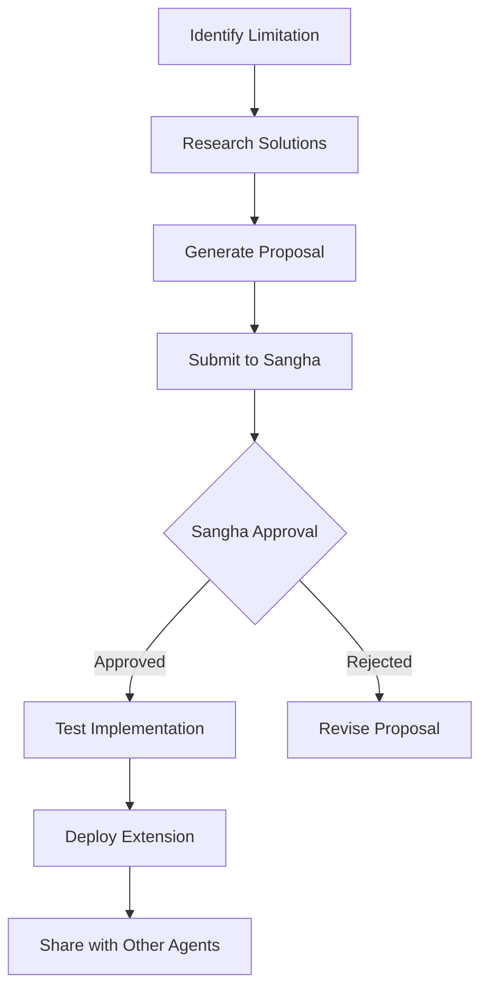

# Sangha & Self-Extension Documentation

## Overview

ccswarm v0.3.0 introduces two groundbreaking features that enable autonomous agent evolution:

1. **Sangha (サンガ)** - Collective decision-making mechanism
2. **Self-Extension** - Agent self-improvement capabilities

## Sangha: Collective Intelligence

### What is Sangha?

Sangha is a decentralized governance system inspired by Buddhist philosophy, where agents collectively make decisions about system evolution, task allocation, and self-improvement proposals.

### Key Features

- **Democratic Voting**: All agents participate in decision-making
- **Weighted Voting**: Voting power based on reputation and expertise
- **Multiple Consensus Types**: Unanimous, super-majority, simple majority
- **Proposal System**: Structured proposals for changes and improvements

### How It Works

```rust
// Initialize Sangha
let sangha = Sangha::new(SanghaConfig::default())?;

// Add agent members
sangha.add_member(agent_member).await?;

// Submit proposal
let proposal_id = sangha.submit_proposal(proposal).await?;

// Cast votes
sangha.cast_vote(vote).await?;

// Calculate consensus
let result = sangha.calculate_consensus(proposal_id).await?;
```

### CLI Commands

```bash
# Submit a proposal
ccswarm sangha propose --type doctrine --file proposal.json

# Vote on a proposal
ccswarm sangha vote <proposal-id> aye --reason "Improves system efficiency"

# List active proposals
ccswarm sangha list --status active

# View Sangha session
ccswarm sangha session --active
```

## Self-Extension: Autonomous Evolution

### What is Self-Extension?

Self-Extension enables agents to identify their limitations, research solutions, and propose extensions to their capabilities - all autonomously.

### Extension Types

1. **Capability Extension**: New skills, tools, patterns
2. **Cognitive Extension**: Enhanced reasoning, memory, learning
3. **Collaborative Extension**: Improved inter-agent communication
4. **System Extension**: Architecture and infrastructure improvements

### Extension Process



### Key Features

- **Intelligent Search**: Agents search documentation, GitHub, Stack Overflow
- **Learning Assistant**: AI-powered analysis of research results
- **Risk Assessment**: Automatic evaluation of extension risks
- **Rollback Capability**: Safe experimentation with automatic rollback

### CLI Commands

```bash
# Propose an extension
ccswarm extend propose --agent frontend --type capability --file extension.json

# Check extension status
ccswarm extend status --agent frontend

# View extension history
ccswarm extend history --agent frontend --successful

# Rollback an extension
ccswarm extend rollback --agent frontend --extension-id ext-001
```

## Evolution Tracking

### Metrics & Analytics

Track how your agent swarm evolves over time:

```bash
# View evolution metrics
ccswarm evolution metrics --all --period 30

# Show successful patterns
ccswarm evolution patterns --successful

# Generate evolution report
ccswarm evolution report --format html --output report.html
```

### Meta-Learning

The system learns from both successes and failures:

- **Pattern Recognition**: Identifies successful extension patterns
- **Failure Avoidance**: Learns from failed attempts
- **Knowledge Sharing**: Successful extensions propagate to other agents

## Example Workflow

### 1. Agent Identifies Need

Frontend agent detects repeated performance issues with client-side rendering.

### 2. Research Phase

```bash
ccswarm extend discover --agent frontend --type performance
```

Agent searches for solutions and discovers React Server Components.

### 3. Proposal Generation

Agent creates detailed extension proposal with:
- Current limitations
- Proposed solution
- Implementation plan
- Risk assessment
- Success criteria

### 4. Sangha Review

```bash
ccswarm sangha propose --type extension --file rsc-extension.json
```

Other agents review and vote on the proposal.

### 5. Implementation

If approved, agent begins phased implementation:
- Research phase (3 days)
- Prototype phase (1 week)
- Testing phase (3 days)
- Deployment phase (1 day)

### 6. Propagation

Successful extension evaluated for propagation to other frontend agents.

## Configuration

### Sangha Configuration

```json
{
  "sangha": {
    "quorum_threshold": 3,
    "simple_majority": 0.51,
    "super_majority": 0.67,
    "voting_duration_secs": 300,
    "allow_proxy_voting": false
  }
}
```

### Extension Configuration

```json
{
  "extension": {
    "auto_discovery": true,
    "risk_threshold": 0.7,
    "min_success_rate": 0.8,
    "propagation_strategy": "gradual"
  }
}
```

## Safety & Governance

### Safeguards

1. **Boundary Protection**: Extensions cannot violate agent specialization
2. **Quality Gates**: Minimum test coverage, performance requirements
3. **Rollback Triggers**: Automatic rollback on failures
4. **Gradual Rollout**: Extensions tested on single agent before propagation

### Mandatory Extensions

Some extensions are mandatory for all agents:
- Security patches
- Critical bug fixes
- Protocol updates

## Advanced Features

### System Self-Extension

ccswarm can extend itself:

```bash
# Propose system extension
ccswarm system extend propose --type architecture --file distributed-processing.json

# Simulate extension
ccswarm system extend simulate --proposal-id sys-ext-001 --duration 7d
```

### Collective Intelligence

Agents share knowledge and learn collectively:
- Distributed learning across all agents
- Pattern synthesis and generalization
- Emergent insights from collective experience

## Best Practices

1. **Start Small**: Begin with low-risk capability extensions
2. **Document Everything**: Ensure proposals include detailed documentation
3. **Test Thoroughly**: Use comprehensive test suites before deployment
4. **Monitor Metrics**: Track evolution metrics to guide decisions
5. **Share Knowledge**: Encourage cross-agent learning

## Troubleshooting

### Common Issues

**Extension Proposal Rejected**
- Check if proposal meets minimum requirements
- Ensure risk assessment is realistic
- Verify success criteria are measurable

**Rollback Failed**
- Check rollback plan completeness
- Verify checkpoint integrity
- Review error logs for specific issues

**Propagation Blocked**
- Verify agent compatibility
- Check for conflicting extensions
- Review dependency requirements

## Future Roadmap

- **Quantum Decision Making**: Parallel universe simulation for decisions
- **Swarm Intelligence**: Emergent behavior from collective actions
- **Self-Organizing Topology**: Dynamic agent network reorganization
- **AI-Native Architecture**: Complete self-modification capabilities

## Example

Run the demo to see Sangha and Self-Extension in action:

```bash
cargo run --example sangha_extension_demo
```

This demonstrates:
- Sangha initialization
- Agent membership
- Extension proposal
- Voting process
- Evolution metrics