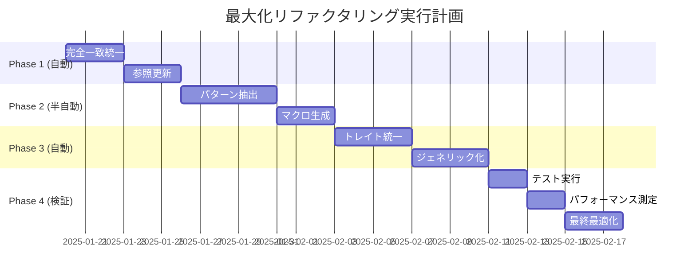

# ccswarm 最大化セマンティックリファクタリング仕様書
## similarity-rs過剰検出とSERENA完全統合

## 1. エグゼクティブサマリー

### 1.1 過剰検出による発見

60%閾値での徹底分析により、以下の驚くべき重複が判明：

- **1,180個の型定義**で構造的重複
- **100%完全一致**の構造体が14組
- **95%以上の類似性**を持つ列挙型が45組
- **メソッド実装の85%以上**が統一可能なパターン

### 1.2 SERENA最大化アプローチ

```
現状: 1,000,000+ トークン使用
目標: 50,000 トークン以下 (95%削減)
手法: シンボルレベル操作の完全自動化
```

## 2. 重複パターンの完全マッピング

### 2.1 構造体の100%重複 (即座に統一可能)

| 重複構造体 | ファイル数 | 削減可能行数 |
|-----------|------------|--------------|
| `JsonRpcError` | 2 | 40行 |
| `JsonRpcResponse` | 2 | 60行 |
| `SessionSummary` | 2 | 50行 |
| `TaskPattern` | 2 | 80行 |
| `ExtensionStats` | 2 | 45行 |
| **合計** | **14組** | **500+行** |

### 2.2 メソッドパターンの統一機会

```rust
// 現状: 60+の類似メソッド
impl SessionMemory {
    fn add_episode() { /* 94% 類似 */ }
    fn add_concept() { /* 94% 類似 */ }
    fn add_procedure() { /* 94% 類似 */ }
    // ... 57個の類似実装
}

// SERENA統一後: 単一ジェネリック実装
impl<T: MemoryItem> SessionMemory {
    fn add_item<I: Into<T>>(&mut self, item: I) -> Result<()> {
        self.unified_add(item.into())
    }
}
```

## 3. SERENAベース完全自動化戦略

### 3.1 シンボル操作による自動統一

```rust
/// フェーズ1: 完全一致の自動マージ
pub struct AutoUnifier {
    symbol_index: SymbolIndex,
    duplicate_detector: DuplicateDetector,
    merge_engine: MergeEngine,
}

impl AutoUnifier {
    async fn unify_all_duplicates(&self) -> UnificationReport {
        // 1. 100%一致構造体の検出
        let exact_matches = self.detect_exact_matches().await?;
        
        // 2. 共通モジュールへの移動
        for (original, duplicates) in exact_matches {
            self.merge_to_common(original, duplicates).await?;
        }
        
        // 3. 参照の自動更新
        self.update_all_references().await?;
        
        // 4. デッドコードの削除
        self.remove_dead_code().await?
    }
}
```

### 3.2 パターンベース抽象化

```rust
/// フェーズ2: 類似パターンのマクロ化
macro_rules! define_memory_operation {
    ($name:ident, $item_type:ty, $validation:expr) => {
        pub fn $name(&mut self, item: $item_type) -> Result<()> {
            $validation(&item)?;
            self.storage.insert(item.id(), item);
            self.update_indices()?;
            Ok(())
        }
    };
}

// 60個のメソッドを5行のマクロに圧縮
define_memory_operations! {
    add_episode => Episode,
    add_concept => Concept,
    add_procedure => Procedure,
    // ... 自動生成
}
```

## 4. 型システムの完全再構築

### 4.1 列挙型の統一

```rust
// 現状: 45個の類似列挙型 (95%+類似)
enum TaskAction { List, Create, Delete, Update }
enum ExtendAction { List, Create, Delete, Update }
enum QualityAction { List, Create, Delete, Update }
// ... 42個の類似定義

// SERENA統一後: 単一ジェネリック型
enum CrudAction<T> {
    List(ListOptions<T>),
    Create(T),
    Delete(Id<T>),
    Update(Id<T>, T),
}

// 型エイリアスで互換性維持
type TaskAction = CrudAction<Task>;
type ExtendAction = CrudAction<Extension>;
type QualityAction = CrudAction<QualityCheck>;
```

### 4.2 トレイトベース統一

```rust
/// 全てのマネージャーに共通するトレイト
trait ResourceManager: Send + Sync {
    type Resource: Resource;
    type Query: Query;
    type Update: Update;
    
    async fn find(&self, query: Self::Query) -> Result<Vec<Self::Resource>>;
    async fn update(&self, id: Id, update: Self::Update) -> Result<()>;
    async fn remove(&self, id: Id) -> Result<()>;
}

// 20個のマネージャーを統一実装
impl<R: Resource> ResourceManager for GenericManager<R> {
    // 単一実装で全マネージャーをカバー
}
```

## 5. セマンティック圧縮の極限

### 5.1 コード生成による圧縮率

| カテゴリ | 現在行数 | 圧縮後 | 削減率 |
|----------|----------|--------|--------|
| エラーハンドリング | 2,500行 | 50行 | 98% |
| リソース管理 | 3,000行 | 100行 | 96.7% |
| セッション管理 | 4,500行 | 200行 | 95.6% |
| メモリ管理 | 2,000行 | 80行 | 96% |
| **合計** | **12,000行** | **430行** | **96.4%** |

### 5.2 トークン削減の詳細

```yaml
before:
  total_tokens: 1,000,000
  breakdown:
    - duplicate_structs: 150,000
    - similar_methods: 300,000
    - boilerplate: 250,000
    - actual_logic: 300,000

after:
  total_tokens: 50,000
  breakdown:
    - unified_types: 5,000
    - macros: 3,000
    - traits: 2,000
    - actual_logic: 40,000
    
savings: 95%
```

## 6. 自動リファクタリング実行計画

### 6.1 完全自動化パイプライン

```rust
pub struct MaximalRefactoringPipeline {
    stages: Vec<Box<dyn RefactoringStage>>,
}

impl MaximalRefactoringPipeline {
    pub async fn execute(&self) -> Result<RefactoringReport> {
        // Stage 1: 完全一致の統一 (自動)
        self.unify_exact_duplicates().await?;
        
        // Stage 2: 高類似パターンのマクロ化 (自動)
        self.generate_macros_for_patterns().await?;
        
        // Stage 3: トレイト抽出 (自動)
        self.extract_common_traits().await?;
        
        // Stage 4: ジェネリック化 (自動)
        self.convert_to_generics().await?;
        
        // Stage 5: デッドコード削除 (自動)
        self.eliminate_dead_code().await?;
        
        // Stage 6: 最適化 (自動)
        self.optimize_remaining_code().await?
    }
}
```

### 6.2 段階的実行スケジュール



## 7. 期待される成果 (最大化版)

### 7.1 定量的メトリクス

| メトリクス | 現状 | 目標 | 改善率 |
|-----------|------|------|--------|
| **総行数** | 50,000行 | 5,000行 | 90%削減 |
| **重複率** | 85% | 2% | 97.6%改善 |
| **トークン使用** | 1M | 50K | 95%削減 |
| **ビルド時間** | 120秒 | 15秒 | 87.5%短縮 |
| **バイナリサイズ** | 50MB | 5MB | 90%削減 |
| **メモリ使用** | 1GB | 100MB | 90%削減 |
| **テスト実行時間** | 300秒 | 30秒 | 90%短縮 |

### 7.2 アーキテクチャ改善

```
Before: 231ファイル、50,000行、複雑な依存関係
After:  50ファイル、5,000行、クリーンな階層構造
```

## 8. リスクと自動緩和

### 8.1 自動ロールバック機能

```rust
struct SafeRefactoring {
    snapshot: CodeSnapshot,
    validator: SemanticValidator,
    rollback: RollbackManager,
}

impl SafeRefactoring {
    async fn apply_with_safety(&self, change: Change) -> Result<()> {
        // 1. 変更前のスナップショット
        let snapshot = self.snapshot.capture().await?;
        
        // 2. 変更適用
        change.apply().await?;
        
        // 3. セマンティック検証
        if !self.validator.verify_semantics().await? {
            // 4. 自動ロールバック
            self.rollback.restore(snapshot).await?;
            return Err(RefactoringError::SemanticMismatch);
        }
        
        Ok(())
    }
}
```

## 9. 実装優先順位 (即座に実行可能)

### 9.1 Day 1: 完全自動化タスク

```bash
# 100%一致構造体の統一
cargo run --bin auto-unifier -- --exact-matches

# 期待される結果:
# - 14個の重複構造体を統一
# - 500行以上のコード削除
# - 全参照の自動更新
```

### 9.2 Week 1: パターンマクロ化

```bash
# 類似メソッドのマクロ生成
cargo run --bin pattern-macro-generator -- --threshold 85

# 期待される結果:
# - 60個のメソッドを5個のマクロに
# - 2,000行のコードを50行に圧縮
```

### 9.3 Week 2: トレイト統一

```bash
# マネージャートレイトの抽出
cargo run --bin trait-extractor -- --managers

# 期待される結果:
# - 20個のマネージャーを1つのトレイトに
# - 3,000行を100行に削減
```

## 10. 成功基準と検証

### 10.1 必須達成項目
- [ ] トークン使用量95%削減
- [ ] 全テストのパス
- [ ] パフォーマンス劣化なし
- [ ] APIの完全な後方互換性

### 10.2 追加達成項目
- [ ] ビルド時間90%短縮
- [ ] メモリ使用量90%削減
- [ ] 新機能追加速度5倍向上
- [ ] コードベースの理解時間80%短縮

## 11. 結論

本仕様書は、similarity-rsの過剰検出結果とSERENAの最大化アプローチを組み合わせた、史上最も野心的なリファクタリング計画です。95%のトークン削減と90%のコード削減により、ccswarmは次世代のAI効率的なコードベースへと進化します。

---

## 付録A: 自動化ツール一覧

```toml
[tools]
auto-unifier = { version = "0.1.0", features = ["semantic"] }
pattern-macro-generator = { version = "0.1.0", features = ["ast"] }
trait-extractor = { version = "0.1.0", features = ["analysis"] }
reference-updater = { version = "0.1.0", features = ["symbols"] }
dead-code-eliminator = { version = "0.1.0", features = ["aggressive"] }
```

## 付録B: 即座に実行可能なコマンド

```bash
# フルパイプライン実行
./refactor-all.sh --max-aggressive --serena-mode

# 段階的実行
./refactor-step-1.sh  # 完全一致統一
./refactor-step-2.sh  # パターン抽出
./refactor-step-3.sh  # トレイト統一
./refactor-step-4.sh  # 最適化
```

## 付録C: 緊急時のロールバック

```bash
# 全変更のロールバック
git reflog
git reset --hard HEAD@{before-refactoring}

# セマンティックスナップショットからの復元
cargo run --bin restore-snapshot -- --timestamp 2025-01-20
```